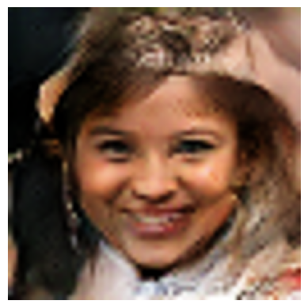

# 🤖 DeepFake Photos Generator

This project implements a Generative Adversarial Network (GAN) that creates realistic human face images. The model is trained on a dataset of human faces and can generate new, artificial faces that don't belong to real people.

### ☁️ Trained on Azure Cloud Using NVIDIA® T4 GPU ⚡

## 🧠 Project Overview

The GAN consists of two neural networks:
- 🧬 **Generator**: Creates synthetic images from random noise
- 🕵️‍♂️ **Discriminator**: Tries to distinguish between real and generated images

Through adversarial training, the generator learns to create increasingly realistic images that can fool the discriminator.

## 📁 Repository Structure

```
DeepFake-Photos-Genrator/
├── README.md
├── 50K-Model/
│ ├── DeepFake-Genrator-50k.zip
│ ├── discriminator_epoch_150.keras
│ ├── discriminator_epoch_200.keras
│ ├── generator_50k_epoch_150.keras
│ ├── generator_epoch_200.keras
│ ├── Load-Model.ipynb
│ ├── Model.ipynb
│ ├── output_sample.png
│ └── README.md

```

## 📦 Requirements

- 🧪 TensorFlow 2.x  
- 🔢 NumPy  
- 📊 Matplotlib  
- 📓 Jupyter Notebook  

## 🚀 Usage

To generate new deepfake images:

1. Open the `Load-Model.ipynb` notebook in Jupyter  
2. Run all cells to generate a new random face 👤  

## 🧾 Model Details

- 🗂️ Trained on **50,000** face images  
- ⚙️ GPU used: **NVIDIA® T4 GPU**  
- 🌌 Latent space dimension: **100**  
- ⏱️ Trained for **150 and 200 epochs**  
- 💾 Checkpoints saved at 150 and 200 epochs  
- 🖼️ Output images upscaled to **260×260 pixels** using bicubic interpolation  

## 🖼️ Sample Output

### 1️⃣ Face generated at epoch 150  
  
This image was generated by the model after 150 training epochs. It shows moderate facial realism with some artifacting in fine details.

### 2️⃣ Face generated at epoch 200  
  
This image was generated by the model after 200 training epochs. The facial structure and lighting are more refined compared to earlier epochs.

## ⚠️ Ethical Considerations

This project is for **educational purposes only**. Use responsibly.

## 🔮 Future Improvements

Training the model on higher-resolution input images is expected to produce significantly more realistic face outputs.
